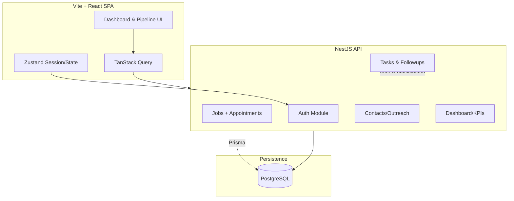

## Job Hunt Management System (MVP)

Job search command centre that keeps daily momentum, tracks KPIs, captures meetings/appointments, and surfaces the next best action. Built as a monorepo with NestJS + Prisma backend and Vite + React + Tailwind frontend.

### Stack

- **Backend**: NestJS modular API (Jobs, Contacts, Tasks, Followups, Dashboard, Auth), Prisma ORM, PostgreSQL, Zod validation, AsyncLocal request context, node-cron notifications, JWT auth.
- **Frontend**: Vite + React (TypeScript), Tailwind, TanStack Query, Zustand store, Radix primitives & Dialogs.
- **Infra**: Docker Compose (postgres + backend + frontend), `.env` driven config, Prisma migrations + seed, context-refresh tooling for docs.

### High-Level Architecture



Frontend talks to the NestJS API via TanStack Query while maintaining session via Zustand. Backend modules share Prisma and AsyncLocal request context to enforce per-user tenancy. Follow-up scheduling feeds both appointments and task reminders which surface back to the UI.

### Features

- Dashboard with daily/weekly KPIs, pipeline heat map, and AI-inspired nudges.
- Jobs Kanban with drag-and-drop stage changes, heat badges, staleness tracking, inline Outreach logging, job notes, and a wizard that logs tailored CV + outreach (auto follow-up).
- Appointment scheduling on jobs/contacts that surfaces prominently on cards and creates linked tasks automatically (meeting/zoom/phone/on-site).
- Networking workspace with strength upgrades, referral insights, history timeline, and contact drawer actions.
- Growth tab for senior reviews, events, boost tasks, and spotlight projects plus auto-generated tasks/reminders.
- Tasks view merging standard follow-ups, appointment tasks, and notifications according to the 3-day rule.
- Recommendation engine scoring jobs/network/growth to produce a single “Next Best Action”.

---

## Getting Started

### 1. Clone & install

```bash
# backend
cd backend
npm install

# frontend
cd ../frontend
npm install
```

### 2. Environment

Copy the template into mode-specific files and populate secrets:

```bash
cp .env.example .env.development
cp .env.example .env.production
```

Use unique database names, secrets, and allowed origins per file. Package scripts automatically load the right env file via `scripts/use-env.js`.

### 3. Database

```bash
cd backend
npx prisma migrate dev
npm run prisma:seed
```

### 4. Run locally

- Backend: `npm run start:dev` (uses `.env.development`, defaults to port `3001`)
- Frontend: `npm run dev` (uses `.env.development`, serves on `5174`)
- Context docs: `npm run refresh:context` (generates API surface, module summary, chunk docs)

Log in with the admin credentials defined in your `.env.development`.

---

## Docker Compose

To run isolated stacks:

```bash
# Development stack
docker compose --env-file .env.development -f docker-compose.dev.yml up -d

# Production stack (sample)
docker compose --env-file .env.production -f docker-compose.prod.yml up -d
```

Each compose file provisions its own Postgres instance, network, volumes, and port mapping. Tear down with `docker compose -f <file> down -v`.

---

## Example Workflow (happy path)

1. **Plan the day**: Open Dashboard → see KPI gaps and the surfaced Next Best Action.
2. **Add opportunity**: In Jobs → click “Add job & outreach”, fill company/role, add tailored CV score, log first outreach (auto follow-up scheduled in 3 days).
3. **Schedule the next step**:
   - If the contact proposes a meeting, use “Schedule” on the job card to log the appointment (Meeting/Zoom/Phone/On-site). A linked Task is created and the appointment takes precedence over generic follow-ups.
   - Daily KPIs increment (Tailored CV + Outreach counters).
   - Dashboard heat map updates with new job record.
4. **Track momentum**:
   - Follow-ups list shows the scheduled reminder or meeting.
   - Contacts drawer timeline displays outreach, follow-ups, and manual notes.
5. **Network boost**: Pop over to Contacts → see strength badges, log referrals/reviews (auto upgrades to STRONG / MEDIUM).
6. **Growth alignment**: Use Growth tab to check senior reviews, event prep, and boost tasks for dry spells.
7. **Close the loop**: On Tasks, mark appointment/follow-up as done. A second attempt auto-schedules; after two attempts notifications queue a dormancy review.

---

## Testing

- **Backend**: `npm run test:e2e` (uses mocked Prisma service to cover `/auth/login`, `/kpis/today`, `/recommendations/next`, scheduler contract).
- **Frontend**: `npm run test` (Vitest + Testing Library; KPI rendering + Next Best Action mocked).

---

## Notable Defaults

- Single-user auth via env-provided credentials (JWT 12h lifetime).
- Follow-up cadence: 3-day rule, max 2 attempts, dormancy notification after 7 idle days.
- Recommendation scoring: heat weight + urgency + staleness plus networking/growth modifiers.
- Tailwind palette tuned for clarity, accent colour `brand = #2563eb`.
